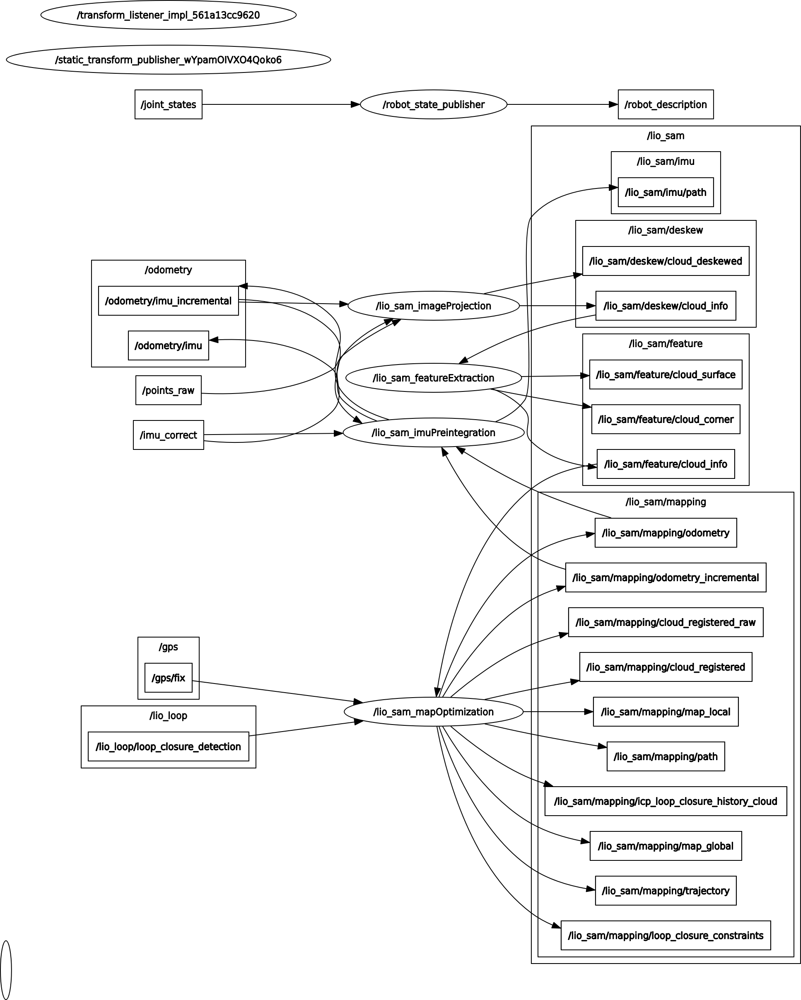
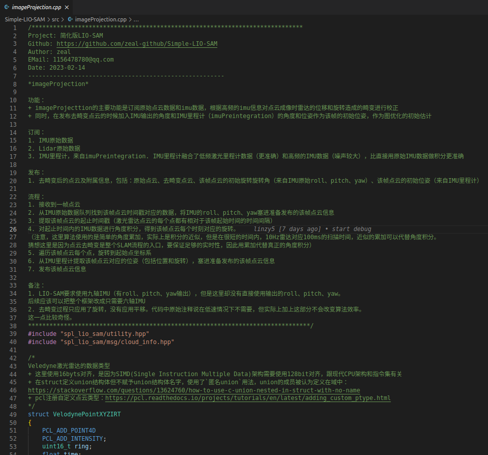
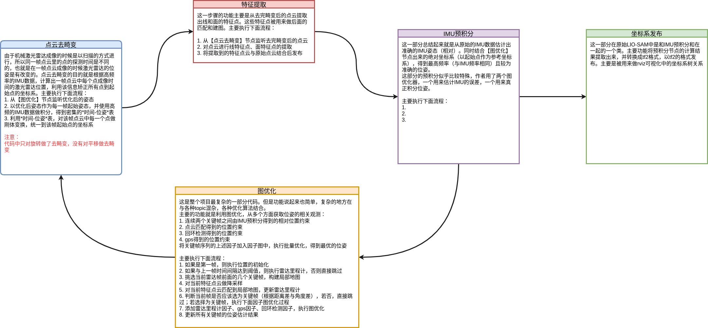

## 文章解读
* :heart_decoration: [Blog](https://zeal-up.github.io/2023/03/13/lio_sam/intro/)
* :six_pointed_star: [知乎](https://www.zhihu.com/column/c_1619085291536433152)

## 本项目目的及特点介绍
[LIOSAM]源代码虽然不能说庞大，甚至可以说简单，因为整个代码库主要只要5个文件。

但是里面每个模块都通过ROS的topic与其他模块有紧密的联系。
整个的流程对新手十分不友好，下图是[LIOSAM]原本运行时的`rqt_graph`




第二个复杂之处在与LIOSAM框架设计到的知识点和工具较多，至少要熟悉`ROS,gtsam,pcl`几个库，算法层面需要熟悉`点云匹配、IMU积分、因子图、三维转换`等。
对于熟悉SLAM的人来说可能较为简单上手，但是对于新入门的人来说则一开始会一头雾水。

基于上述这些原因，笔者进行了[SPL-LIO-SAM](Simple Lio Sam)项目，希望能够以最大幅度帮助初学者理解[LIOSAM]框架及里面的算法细节。
本项目对[LIOSAM]做了如下改进

### 基于ROS2-humble实现
虽然LIOSAM源码中有一个ros2分支，但该分支的维护者并不是原作者，而且已经长时间没有人维护，且该分支存在一些bug没有被修复。为了能够在进行本项目的学习过程中
熟悉最新的ROS2框架，笔者在LIOSAM的ros2分支基础上，修复了存在的bug，同时将功能较为独立的`Transformfusion`类抽取成独立的类。

为了便于上手及部署，笔者同时准备了适配的docker镜像供学习者使用。

### 简化
#### 话题发布的简化
[LIOSAM]原始代码中有很多中间结果的发布，这些中间结果可以用来可视化及调试程序，但是对于学习者和开发者而言不仅意义不大，而且会在初始学习源码阶段误导学习者。
本项目在话题发布上进行`大幅度简化`，简化后的设计如下：


简化后运行时的`rqt_graph`:


#### 坐标系简化
[LIOSAM]中实用的坐标系并不复杂，但是作者提供的`urdf`包含了太多为了兼容性考虑的坐标系，这些坐标系对于实际运行和理解并没有用。因此，本项目基于ROS对坐标系的约束，将
坐标系关系树简化为如下：


#### 保留算法及定义完整性
虽然本项目去除了很多非必要话题，同时对于一些非必要代码也进行了简化，但对一些学习算法有帮助的细节依旧保留。比如激光里程计在发布的时候有`mapping/odometry`和`mapping/odometry_incremental`两个话题，两个话题虽然类似但是背后却有很不同的函数，但同时两者合一又不影响算法的运行。因此采取的做法时在代码中保留这部分代码，同时加以解释，但发布时只发布其中一个话题。

### 完善的注释及流程图
网上其实对[LIOSAM]源码的注释并不少，比如[LIO-SAM-note]和[LIO-SAM-DetailedNote]，还有一些blog也对源码做了解释，但是都不太完美，同时缺少流程性的组织。本项目借鉴了一些开源项目的注释，并加以完善，可以说，本项目是目前对[LIOSAM]注释最完善的开源项目。


为了最为清晰的展示[LIOSAM]算法不同模块的流程，该项目还对各个模块流程进行梳理，建立了完善的流程图设计



## 运行环境搭建
本项目提供基于`ROS2-humble`的镜像，并提供脚本可直接在镜像中启动可视化程序
### 数据
本项目同时提供转为`rosbag2`格式的数据包，[下载地址]()
```bash
export DATA_DIR=/path/to/download/ros2bag/dir
```
本项目中默认的配置文件`params_default.yaml`可以直接运行下面的数据：
- park_dataset
- walking_dataset
- garden_dataset

### 环境部署
```bash
git clone git@github.com:zeal-up/Simple-LIO-SAM.git
cd Simple-LIO-SAM
./docker_run.sh -h  # show help message
./docker_run.sh -c /path/to/code/repo -d $DATA_DIR

# ./docker_into.sh  # enter the container next time
```

### 编译
```bash
cd Simple-LIO-SAM
./docker_into.sh

# 下面命令在镜像中执行
cd ~/ros_ws/
mkdir src && cd src &&ln -s /home/splsam/codes ./
cd ..
source /opt/ros/humble/setup.bash
colcon build --packages-select spl_lio_sam
```

### 运行
```bash
# docker镜像下运行
cd ~/ros_ws
source ./install/setup.bash
ros2 launch spl_lio_sam run.launch.py 

# 新开终端
cd Simple-LIO-SAM
./docker_into.sh
cd data/ros2/
ros2 bag play ./park_dataset/ --topics /points_raw /imu_raw

```
运行时画面：


## 开发环境搭建
由于本项目作者在使用`vscode`开发`c++`时经常会遇到无法快捷跳转问题（其实笔者发现有很多人在使用vscode开发时都会有这个问题），
因此一并把解决方案写入项目中。

### vscode开发cpp函数快捷跳转
1. 安装cpp扩展
vscode侧边栏进入扩展选项（ctrl+shift+x)，搜索`c++`，安装`C/C++ Extension Pack`
1. 打开项目
> File->Open Folder
1. 保存为工作区
> File->Save Workspace as
选择目标目录及文件（默认以`.code-workspace`结尾）
1. 打开刚才保存的工作区文件
> File->Open File
选择刚才打开的工作区文件
1. 对工作区添加`c++`库检索路径
在刚才打开的工作区文件中，参考以下格式编辑
```yaml
{
	"folders": [
		{
			"path": "../Simple-LIO-SAM"
		},
	],
	"settings": {
		"C_Cpp.default.includePath": [
			"${default}",
			"/usr/include/**",
			"/usr/include/c++/9/",
			"/usr/lib/gcc/x86_64-linux-gnu/8/include/",
			"/opt/ros/humble/include/**",

			"${workspaceFolder}/include",

            // 重点！！这里的路径要设置为ros2工作空间下spl_lio_sam编译出来的头文件
			"/path/to/ros2_ws/install/spl_lio_sam/include/spl_lio_sam"

		],
		"C_Cpp.files.exclude": {
			"**/.vscode": true,
			"**/.vs": true
		},
		"C_Cpp.default.cStandard": "c17",
		"C_Cpp.default.cppStandard": "c++17",
		"python.analysis.include": [
			"/opt/ros/humble/lib/python3.10/site-packages",
		],
		"python.autoComplete.extraPaths": [
			"/opt/ros/humble/lib/python3.10/site-packages",
		],
		"python.analysis.extraPaths": [
			"/opt/ros/humble/lib/python3.10/site-packages",
		],
	}
}
```
### 对工作区文件的解释
其实主要起作用的是工作区文件中`settings->C_Cpp.default.includePath`字段内容，vscode的cpp扩展会读取该工作空间文件下
的这个字段，并将里面的路径进行解析加到头文件解析路径中。

这里有两个路径要注意的
1. `"${workspaceFolder}/include"`，也就是Simple-LIO-SAM仓库下的include路径
2. `"/path/to/ros2_ws/install/spl_lio_sam/include/spl_lio_sam"`，这个要设置成你的ros工作空间对应的路径


另外，如果发现自己路径设置完成，但是有些函数还提示下划线，要看看是不是那些函数是`c++17`或者更高的标准才支持的特性，在上面的配置文件中
设置c++/c标准为17

### 其余注意
1. 尽量不要用`/path/**`的格式添加include路径，虽然看起来很省事，但会影响检索效率
1. 刚设置完路径需要等待vscode检索构建数据库，在vscode右下方状态条会提示正在进行检索
1. 上面配置文件中`"python.analysis.extraPaths","python.autoComplete.extraPaths","python.analysis.include"`是设置python语法提示器的
库检索路径，不同的python提示器插件会使用不同的路径。

## 本项目所有文章
1. [Simple-LIO-SAM——（一）项目简介](https://zeal-up.github.io/2023/03/13/lio_sam/intro/)
1. [Simple-LIO-SAM——（二）环境搭建与运行](https://zeal-up.github.io/2023/03/14/lio_sam/%E7%8E%AF%E5%A2%83%E6%90%AD%E5%BB%BA%E4%B8%8E%E8%BF%90%E8%A1%8C/)
1. [Simple-LIO-SAM——（三）总体流程认识](https://zeal-up.github.io/2023/03/16/lio_sam/%E6%80%BB%E4%BD%93%E6%B5%81%E7%A8%8B%E8%AE%A4%E8%AF%86/)
1. [Simple-LIO-SAM——（四）utility文件解读](https://zeal-up.github.io/2023/03/22/lio_sam/utility%E6%96%87%E4%BB%B6%E8%A7%A3%E8%AF%BB/)
1. [Simple-LIO-SAM——（五）点云去畸变模块](https://zeal-up.github.io/2023/03/22/lio_sam/imageProjection-doc/)
1. [Simple-LIO-SAM——（六）特征提取模块](https://zeal-up.github.io/2023/03/22/lio_sam/featureExtraction-doc/)
1. [Simple-LIO-SAM——（七）GTSAM快速入门](https://zeal-up.github.io/2023/03/27/lio_sam/gtsam-quickstart/)
1. [Simple-LIO-SAM——（八）IMU预积分模块](https://zeal-up.github.io/2023/03/30/lio_sam/imuPreintegration-doc/)
1. [Simple-LIO-SAM——（九）点云匹配算法详解](https://zeal-up.github.io/2023/04/06/lio_sam/pcdRegistration-doc/)
1. [Simple-LIO-SAM——（十）后端优化模块详解](https://zeal-up.github.io/2023/04/11/lio_sam/mapOptimization-doc/)


## Reference
1. [LIO-SAM](https://github.com/TixiaoShan/LIO-SAM)
2. [LIO-SAM paper](https://arxiv.org/abs/2007.00258)
3. [This Project](https://github.com/zeal-up/Simple-LIO-SAM)
4. [LIO-SAM-note](https://github.com/chennuo0125-HIT/LIO-SAM-note)
5. [LIO-SAM-DetailedNote](https://github.com/smilefacehh/LIO-SAM-DetailedNote)


[TixiaoShan]:https://github.com/TixiaoShan "作者Github"
[LIOSAM]:https://arxiv.org/abs/2007.00258 "liosam论文"
[spl]:https://github.com/zeal-up/Simple-LIO-SAM "Simple LIO-SAM"
[LIO-SAM-note]:https://github.com/chennuo0125-HIT/LIO-SAM-note "LIO-SAM-note"
[LIO-SAM-DetailedNote]:https://github.com/smilefacehh/LIO-SAM-DetailedNote "LIO-SAM-DetailedNote"